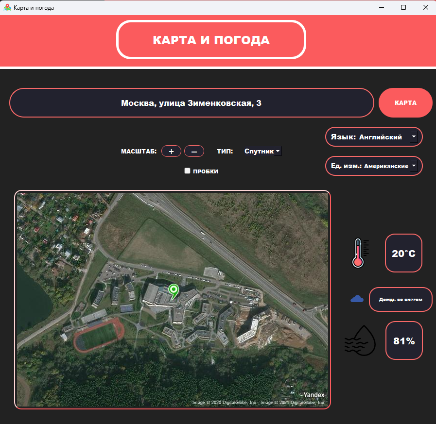
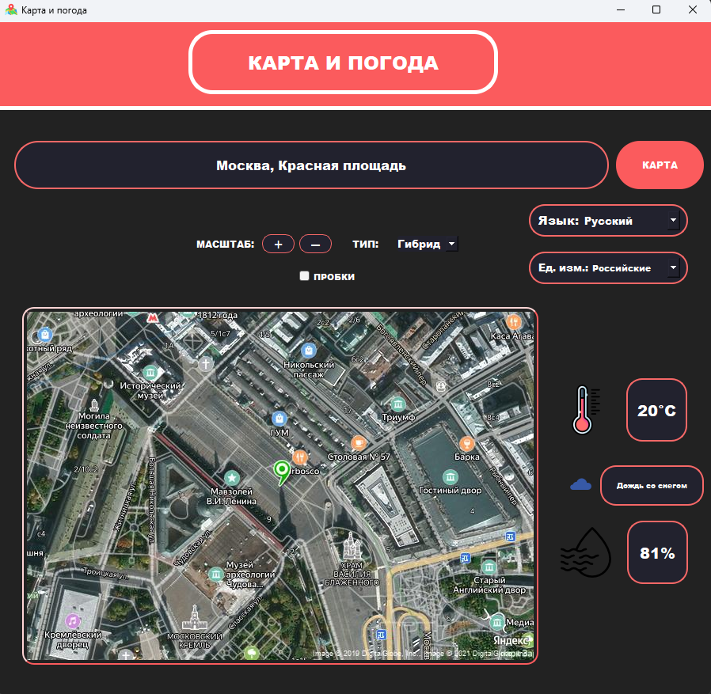
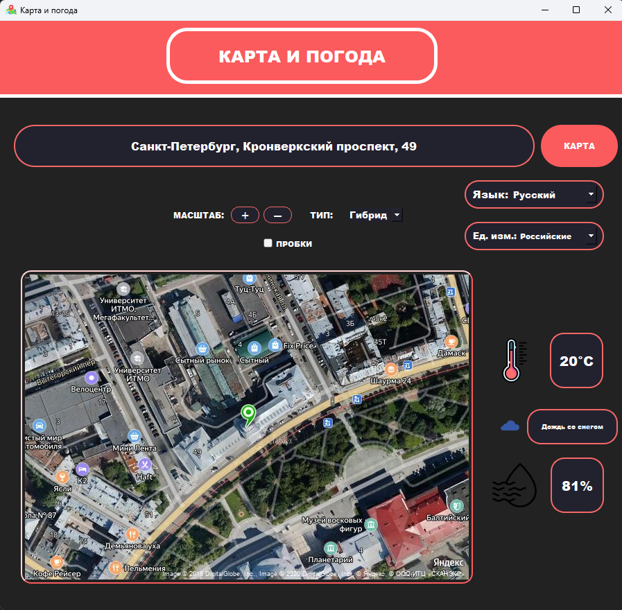

# UI MapWeather App

## Lightweight UI app with weather and Static Maps and Geocoder API from Yandex.

I made it for API topic on informatics course in Letovo School.

## Images

**requirements**
json
requests
yandex_geocoder
pyqt5
